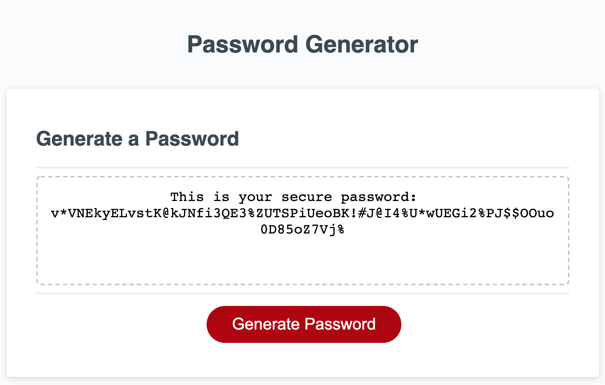

# Code Generator

# Description

This app allows the user to create a password with the different options the user chooses. The user can choose the lenght of the password, whether the password will have uppercase letters, lowercase letters, numbers and/or symbols. 

## Screenshots of Password Generator

# Table of Contents

* [Installation](#installation)
    
* [Usage](#usage)

* [Technology](#technology)

* [License](#license)

* [Contributors](#contributors)

* [Questions](#questions)

# Installation

Visit the deployed app in the following link: https://blen90.github.io/code-generator/ 

# Usage
 
The user can create a random password by choosing the length of the password, whether the password will have uppercase letters, lowercase letters, numbers and/or symbols. 

# Technology

* HTML
* CSS
* Javascript

# License 

This project is governed by: MIT License

# Contributors

Blenda Orellana

# Questions

If you have any questions about the repo or the app please feel free to contact me
 * Email: blen.or90@gmail.com
 * Github: https://github.com/blen90

